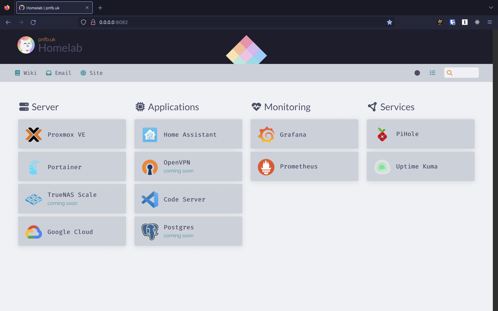
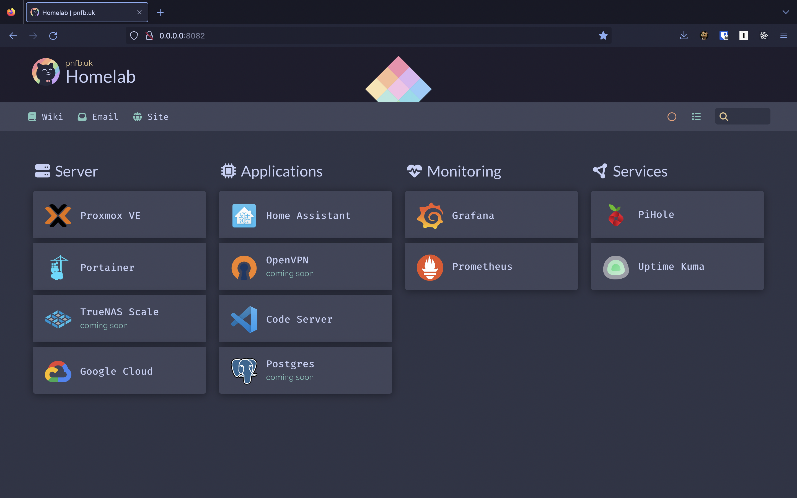
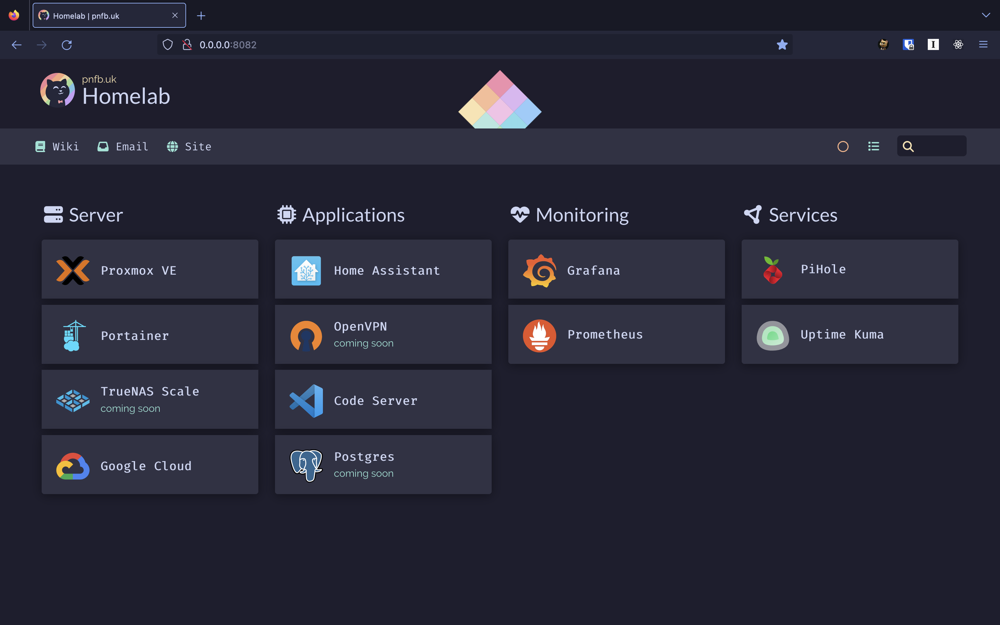

<h3 align="center">
	<br/>
	
	Catppuccin Theme for Homer
	
</h3>

<p align="center">
  
</p>

Inspired by the [catppuccin](https://github.com/catppuccin) macchiato palette. A
new [homer dashboard](https://github.com/bastienwirtz/homer) theme.


## Activating theme

Pick your flavour

<details>
<summary>🌻 Latte</summary>

To use the latte theme you will need to change the default theme to `light` like
so:

```yaml
defaults:
  colorTheme: light # One of 'auto', 'light', or 'dark'
```



### Colors used

<table>
	<tr>
		<th></th>
		<th>Labels</th>
		<th>Hex</th>
		<th>RGB</th>
		<th>HSL</th>
	</tr>
		<tr>
		<td></td>
		<td>Pink</td>
		<td><code>#ea76cb</code></td>
		<td><code>rgb(234, 118, 203)</code></td>
		<td><code>hsl(316, 73%, 69%)</code></td>
	</tr>
	<tr>
		<td></td>
		<td>Mauve</td>
		<td><code>#8839ef</code></td>
		<td><code>rgb(136, 57, 239)</code></td>
		<td><code>hsl(266, 85%, 58%)</code></td>
	</tr>
	<tr>
		<td></td>
		<td>Red</td>
		<td><code>#d20f39</code></td>
		<td><code>rgb(210, 15, 57)</code></td>
		<td><code>hsl(347, 87%, 44%)</code></td>
	</tr>
		<tr>
		<td></td>
		<td>Peach</td>
		<td><code>#fe640b</code></td>
		<td><code>rgb(254, 100, 11)</code></td>
		<td><code>	hsl(22, 99%, 52%)</code></td>
	</tr>
	<tr>
		<td></td>
		<td>Yellow</td>
		<td><code>#df8e1d</code></td>
		<td><code>rgb(223, 142, 29)</code></td>
		<td><code>hsl(35, 77%, 49%)</code></td>
	</tr>
	<tr>
		<td></td>
		<td>Green</td>
		<td><code>#40a02b</code></td>
		<td><code>rgb(64, 160, 43)</code></td>
		<td><code>hsl(109, 58%, 40%)</code></td>
	</tr>
	<tr>
		<td></td>
		<td>Teal</td>
		<td><code>#179299</code></td>
		<td><code>rgb(23, 146, 153)</code></td>
		<td><code>hsl(183, 74%, 35%)</code></td>
	</tr>
	<tr>
		<td></td>
		<td>Text</td>
		<td><code>#4c4f69</code></td>
		<td><code>rgb(76, 79, 105)</code></td>
		<td><code>hsl(234, 16%, 35%)</code></td>
	</tr>
	<tr>
		<td></td>
		<td>Surface2</td>
		<td><code>#acb0be</code></td>
		<td><code>rgb(172, 176, 190)</code></td>
		<td><code>hsl(227, 12%, 71%)</code></td>
	</tr>
	<tr>
		<td></td>
		<td>Surface0</td>
		<td><code>#ccd0da</code></td>
		<td><code>rgb(204, 208, 218)</code></td>
		<td><code>hsl(223, 16%, 83%)</code></td>
	</tr>
	<tr>
		<td></td>
		<td>Base</td>
		<td><code>#eff1f5</code></td>
		<td><code>rgb(239, 241, 245)</code></td>
		<td><code>hsl(220, 23%, 95%)</code></td>
	</tr>
</table>
</details>

<details>
<summary>🪴 Frappé</summary>



### Colors used

<table>
	<tr>
		<th></th>
		<th>Labels</th>
		<th>Hex</th>
		<th>RGB</th>
		<th>HSL</th>
	</tr>
	<tr>
		<td></td>
		<td>Pink</td>
		<td><code>#f4b8e4</code></td>
		<td><code>rgb(244, 184, 228)</code></td>
		<td><code>hsl(316, 73%, 84%)</code></td>
	</tr>
	<tr>
		<td></td>
		<td>Mauve</td>
		<td><code>#ca9ee6</code></td>
		<td><code>rgb(202, 158, 230)</code></td>
		<td><code>hsl(277, 59%, 76%)</code></td>
	</tr>
	<tr>
		<td></td>
		<td>Red</td>
		<td><code>#e78284</code></td>
		<td><code>rgb(231, 130, 132)</code></td>
		<td><code>hsl(359, 68%, 71%)</code></td>
	</tr>
	<tr>
		<td></td>
		<td>Peach</td>
		<td><code>#ef9f76</code></td>
		<td><code>rgb(239, 159, 118)</code></td>
		<td><code>hsl(20, 79%, 70%)</code></td>
	</tr>
	<tr>
		<td></td>
		<td>Yellow</td>
		<td><code>#e5c890</code></td>
		<td><code>rgb(229, 200, 144)</code></td>
		<td><code>hsl(40, 62%, 73%)</code></td>
	</tr>
	<tr>
		<td></td>
		<td>Green</td>
		<td><code>#a6d189</code></td>
		<td><code>rgb(166, 209, 137)</code></td>
		<td><code>hsl(96, 44%, 68%)</code></td>
	</tr>
	<tr>
		<td></td>
		<td>Teal</td>
		<td><code>#81c8be</code></td>
		<td><code>rgb(129, 200, 190)</code></td>
		<td><code>hsl(172, 39%, 65%)</code></td>
	</tr>
	<tr>
		<td></td>
		<td>Text</td>
		<td><code>#c6d0f5</code></td>
		<td><code>rgb(198, 208, 245)</code></td>
		<td><code>hsl(227, 70%, 87%)</code></td>
	</tr>
	<tr>
		<td></td>
		<td>Surface2</td>
		<td><code>#626880</code></td>
		<td><code>rgb(98, 104, 128)</code></td>
		<td><code>hsl(228, 13%, 44%)</code></td>
	</tr>
	<tr>
		<td></td>
		<td>Surface0</td>
		<td><code>#414559</code></td>
		<td><code>rgb(65, 69, 89)</code></td>
		<td><code>hsl(230, 16%, 30%)</code></td>
	</tr>
	<tr>
		<td></td>
		<td>Base</td>
		<td><code>#303446</code></td>
		<td><code>rgb(48, 52, 70)</code></td>
		<td><code>hsl(229, 19%, 23%)</code></td>
	</tr>
</table>
</details>

<details>
<summary>🌺 Macchiato</summary>


### Colors used

<table>
	<tr>
		<th></th>
		<th>Labels</th>
		<th>Hex</th>
		<th>RGB</th>
		<th>HSL</th>
	</tr>
	<tr>
		<td></td>
		<td>Pink</td>
		<td><code>#f5bde6</code></td>
		<td><code>rgb(245, 189, 230)</code></td>
		<td><code>hsl(316, 74%, 85%)</code></td>
	</tr>
	<tr>
		<td></td>
		<td>Mauve</td>
		<td><code>#c6a0f6</code></td>
		<td><code>rgb(198, 160, 246)</code></td>
		<td><code>hsl(267, 83%, 80%)</code></td>
	</tr>
	<tr>
		<td></td>
		<td>Red</td>
		<td><code>#ed8796</code></td>
		<td><code>rgb(237, 135, 150)</code></td>
		<td><code>hsl(351, 74%, 73%)</code></td>
	</tr>
		<tr>
		<td></td>
		<td>Peach</td>
		<td><code>#f5a97f</code></td>
		<td><code>rgb(245, 169, 127)</code></td>
		<td><code>hsl(21, 86%, 73%)</code></td>
	</tr>
	<tr>
		<td></td>
		<td>Yellow</td>
		<td><code>#eed49f</code></td>
		<td><code>rgb(238, 212, 159)</code></td>
		<td><code>hsl(40, 70%, 78%)</code></td>
	</tr>
	<tr>
		<td></td>
		<td>Green</td>
		<td><code>#a6da95</code></td>
		<td><code>rgb(166, 218, 149)</code></td>
		<td><code>hsl(105, 48%, 72%)</code></td>
	</tr>
	<tr>
		<td></td>
		<td>Teal</td>
		<td><code>#8bd5ca</code></td>
		<td><code>rgb(139, 213, 202)</code></td>
		<td><code>hsl(171, 47%, 69%)</code></td>
	</tr>
	<tr>
		<td></td>
		<td>Text</td>
		<td><code>#cad3f5</code></td>
		<td><code>rgb(202, 211, 245)</code></td>
		<td><code>hsl(227, 68%, 88%)</code></td>
	</tr>
	<tr>
		<td></td>
		<td>Surface2</td>
		<td><code>#5b6078</code></td>
		<td><code>rgb(91, 96, 120)</code></td>
		<td><code>hsl(230, 14%, 41%)</code></td>
	</tr>
	<tr>
		<td></td>
		<td>Surface0</td>
		<td><code>#363a4f</code></td>
		<td><code>rgb(54, 58, 79)</code></td>
		<td><code>hsl(230, 19%, 26%)</code></td>
	</tr>
	<tr>
		<td></td>
		<td>Base</td>
		<td><code>#24273a</code></td>
		<td><code>rgb(36, 39, 58)</code></td>
		<td><code>hsl(232, 23%, 18%)</code></td>
	</tr>
</table>
</details>

<details>
<summary>🌿 Mocha</summary>



### Colors used

<table>
	<tr>
		<th></th>
		<th>Labels</th>
		<th>Hex</th>
		<th>RGB</th>
		<th>HSL</th>
	</tr>
	<tr>
		<td></td>
		<td>Pink</td>
		<td><code>#f5c2e7</code></td>
		<td><code>rgb(245, 194, 231)</code></td>
		<td><code>hsl(316, 72%, 86%)</code></td>
	</tr>
	<tr>
		<td></td>
		<td>Mauve</td>
		<td><code>#cba6f7</code></td>
		<td><code>rgb(203, 166, 247)</code></td>
		<td><code>hsl(267, 84%, 81%)</code></td>
	</tr>
	<tr>
		<td></td>
		<td>Red</td>
		<td><code>#f38ba8</code></td>
		<td><code>rgb(243, 139, 168)</code></td>
		<td><code>hsl(343, 81%, 75%)</code></td>
	</tr>
	<tr>
		<td></td>
		<td>Peach</td>
		<td><code>#fab387</code></td>
		<td><code>rgb(250, 179, 135)</code></td>
		<td><code>hsl(23, 92%, 75%)</code></td>
	</tr>
	<tr>
		<td></td>
		<td>Yellow</td>
		<td><code>#f9e2af</code></td>
		<td><code>rgb(249, 226, 175)</code></td>
		<td><code>hsl(41, 86%, 83%)</code></td>
	</tr>
	<tr>
		<td></td>
		<td>Green</td>
		<td><code>#a6e3a1</code></td>
		<td><code>rgb(166, 227, 161)</code></td>
		<td><code>hsl(115, 54%, 76%)</code></td>
	</tr>
	<tr>
		<td></td>
		<td>Teal</td>
		<td><code>#94e2d5</code></td>
		<td><code>rgb(148, 226, 213)</code></td>
		<td><code>hsl(170, 57%, 73%)</code></td>
	</tr>
	<tr>
		<td></td>
		<td>Text</td>
		<td><code>#cdd6f4</code></td>
		<td><code>rgb(205, 214, 244)</code></td>
		<td><code>hsl(226, 64%, 88%)</code></td>
	</tr>
	<tr>
		<td></td>
		<td>Surface2</td>
		<td><code>#585b70</code></td>
		<td><code>rgb(88, 91, 112)</code></td>
		<td><code>hsl(233, 12%, 39%)</code></td>
	</tr>
	<tr>
		<td></td>
		<td>Surface0</td>
		<td><code>#313244</code></td>
		<td><code>rgb(49, 50, 68)</code></td>
		<td><code>hsl(237, 16%, 23%)</code></td>
	</tr>
	<tr>
		<td></td>
		<td>Base</td>
		<td><code>#1e1e2e</code></td>
		<td><code>rgb(30, 30, 46)</code></td>
		<td><code>hsl(240, 21%, 15%)</code></td>
	</tr>
</table>
</details>

---

- Copy the file of your chosen flavour from [`flavours`](./flavours) over to
  `www/assets/...`
- Copy [`romb.png`](./assets/images/backgrounds/romb.png) to
  `www/assets/romb.png`.
- Put these lines into `www/assets/config.yml` and save the file:

```yaml
stylesheet:
  - 'assets/catppuccin-macchiato.css'
```

For the header logo you can choose either from `dark_circle.png` for use in the
frappe, macchiato and mocha themes. Or if you prefer a light them you can pick
the `light_circle.png` for the latte theme. All that you need to do is edit this
line in your `config.yml`

```yaml
logo: '<location of img>' # example: assets/logo/dark_circle.png
```

## Favicons

I have also included a `.zip` file of required Favicons for light or dark
themes. These are located in [`/favicons`](./favicons). Unzip this file and
place the extracted contents into `www/assets/icons`

<p align="center"></p>
<p align="center">Copyright &copy; 2021-present <a href="https://github.com/catppuccin" target="_blank">Catppuccin Org</a>
<p align="center"><a href="https://github.com/catppuccin/catppuccin/blob/main/LICENSE"></a></p>
